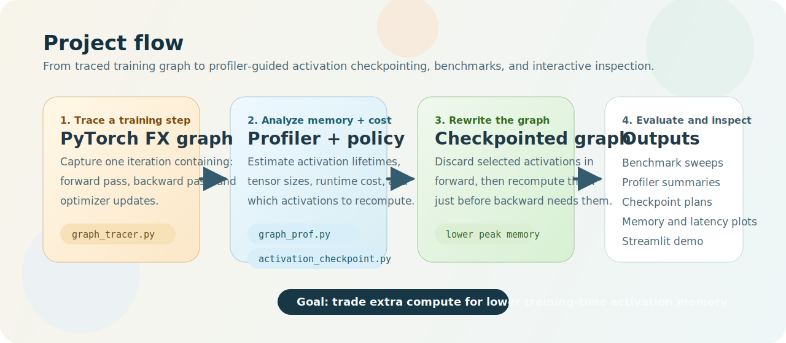

# Activation Checkpointing with PyTorch FX



This repository presents an activation checkpointing prototype built with PyTorch FX tracing. It extends the [Harvard CS265](http://daslab.seas.harvard.edu/classes/cs265/) starter scaffold into a complete workflow for graph capture, profiling, checkpoint planning, benchmarking, and interactive visualization.

The main components are:

- [graph_tracer.py](C:/Users/inorz/OneDrive/Documents/Harvard/mutwo-activation-checkpointing/graph_tracer.py): captures a single training iteration spanning forward, backward, and optimizer work.
- [graph_prof.py](C:/Users/inorz/OneDrive/Documents/Harvard/mutwo-activation-checkpointing/graph_prof.py): performs static and runtime profiling of traced graphs.
- [activation_checkpoint.py](C:/Users/inorz/OneDrive/Documents/Harvard/mutwo-activation-checkpointing/activation_checkpoint.py): builds activation checkpointing plans and rewrites graphs accordingly.
- [benchmarks.py](C:/Users/inorz/OneDrive/Documents/Harvard/mutwo-activation-checkpointing/benchmarks.py): runs baseline and checkpointed experiments for `ResNet-152` and `BERT`.
- [app.py](C:/Users/inorz/OneDrive/Documents/Harvard/mutwo-activation-checkpointing/app.py): launches a Streamlit interface for inspecting results interactively.

## Overview

### Graph profiling

- Detects forward, backward, and optimizer boundaries using separator operators.
- Analyzes activation lifetimes, including creation point, last forward use, first backward use, and tensor size estimates.
- Categorizes placeholders into parameters, buffers, optimizer state, gradients, activations, and other graph values.
- Collects per-node runtime measurements such as latency, output sizes, and CUDA memory snapshots.
- Exports profiler summaries and peak-memory breakdowns as JSON.

### Activation checkpointing policy

- Uses a practical heuristic inspired by [`mu-TWO`](https://proceedings.mlsys.org/paper_files/paper/2023/file/a72071d84c001596e97a2c7e1e880559-Paper-mlsys2023.pdf).
- Ranks activations by estimated memory savings relative to recomputation cost.
- Supports a memory budget, a recomputation budget ratio, and a minimum activation-size threshold.
- Produces a retained-versus-recomputed activation plan for inspection and analysis.

### Graph rewrite

- Extracts recomputation subgraphs using `_extract_graph_with_inputs_outputs`.
- Clones selected forward subgraphs and reinserts them before the first backward-time use of discarded activations.
- Replaces backward-region uses with recomputed values while preserving forward correctness.
- Includes equivalence checks for the toy validation path.

### Benchmarking and visualization

- Runs baseline versus activation-checkpointed experiments for `ResNet-152` and `BERT`.
- Saves profiler summaries, checkpoint plans, peak-memory plots, sweep CSVs, and manifests.
- Provides a Streamlit frontend for interactive experimentation and result inspection.

## Environment Setup

The project assumes Python 3.12 and a CUDA-capable PyTorch installation for the full benchmarking and demo workflow.

### Conda environment

```powershell
conda create -n cs265 python=3.12
conda activate cs265
pip install numpy==2.2.2
pip install torch==2.5.1 torchvision==0.20.1 --index-url https://download.pytorch.org/whl/cu124
pip install transformers matplotlib streamlit expecttest
```

## Quick Start

### Starter flow

Run the small dummy-model example:

```powershell
conda activate cs265
python starter_code.py
```

Run the same flow with activation checkpointing enabled:

```powershell
python starter_code.py --use-ac --output-dir outputs/starter_ac
```

### Validation tests

```powershell
python -m unittest tests.test_graph_profiler tests.test_activation_checkpoint
```

## Running Benchmarks

### ResNet-152

```powershell
python benchmarks.py --model "ResNet-152" --batch-sizes 1 2 4
```

### BERT

```powershell
python benchmarks.py --model "BERT" --batch-sizes 1 2 4 --seq-len 128
```

For faster dry runs on a smaller BERT variant while preserving the overall benchmark flow:

```powershell
python benchmarks.py --model "BERT" --batch-sizes 1 2 --seq-len 128 --debug-bert
```

### Tuning the checkpoint policy

```powershell
python benchmarks.py --model "ResNet-152" --batch-sizes 1 2 4 --memory-budget-mb 6000 --max-recompute-ratio 0.25
```

## Launching the Frontend Demo

```powershell
streamlit run app.py
```

The app supports:

- model selection,
- batch size selection,
- activation checkpointing toggle,
- checkpoint policy tuning,
- viewing profiler summaries,
- viewing retained versus recomputed activations,
- viewing saved peak-memory and sweep plots.

## Outputs

Benchmark and demo artifacts are saved under [outputs](C:/Users/inorz/OneDrive/Documents/Harvard/mutwo-activation-checkpointing/outputs).

Typical generated files include:

- `profiler_summary.json`
- `rewritten_profiler_summary.json`
- `checkpoint_plan.json`
- `peak_memory_breakdown.png`
- `sweep_results.csv`
- `peak_memory_vs_batch_size.png`
- `latency_vs_batch_size.png`
- `manifest.json`

These outputs support reproducibility, benchmarking, analysis, and visualization.

## Assumptions and Limitations

- Full benchmark and demo flows assume CUDA for meaningful memory measurements.
- The `BERT` benchmark path uses a randomly initialized BERT-style masked language model created from configuration, not a downloaded pretrained checkpoint.
- The `--debug-bert` option uses a reduced BERT configuration for quicker validation and iteration.
- The checkpoint policy is heuristic and profiler-driven rather than an exact reproduction of [`mu-TWO`](https://proceedings.mlsys.org/paper_files/paper/2023/file/a72071d84c001596e97a2c7e1e880559-Paper-mlsys2023.pdf).
- The profiler's memory breakdown focuses on parameter, gradient, optimizer-state, and activation memory visible through the traced iteration and static lifetime analysis.
- On CPU, the profiler still runs, but timing and memory results are not representative of the intended target environment.

## Repository Guide

- [graph_tracer.py](C:/Users/inorz/OneDrive/Documents/Harvard/mutwo-activation-checkpointing/graph_tracer.py): FX capture of one training iteration.
- [graph_prof.py](C:/Users/inorz/OneDrive/Documents/Harvard/mutwo-activation-checkpointing/graph_prof.py): graph profiling, activation lifetime analysis, and summary export.
- [activation_checkpoint.py](C:/Users/inorz/OneDrive/Documents/Harvard/mutwo-activation-checkpointing/activation_checkpoint.py): checkpoint selection and graph rewrite.
- [benchmarks.py](C:/Users/inorz/OneDrive/Documents/Harvard/mutwo-activation-checkpointing/benchmarks.py): benchmark runner and plot generation.
- [starter_code.py](C:/Users/inorz/OneDrive/Documents/Harvard/mutwo-activation-checkpointing/starter_code.py): lightweight starter example.
- [app.py](C:/Users/inorz/OneDrive/Documents/Harvard/mutwo-activation-checkpointing/app.py): Streamlit demo frontend.
- [docs](C:/Users/inorz/OneDrive/Documents/Harvard/mutwo-activation-checkpointing/docs): supporting project documents, including [experimental_analysis.md](C:/Users/inorz/OneDrive/Documents/Harvard/mutwo-activation-checkpointing/docs/experimental_analysis.md), [Instruction.pdf](C:/Users/inorz/OneDrive/Documents/Harvard/mutwo-activation-checkpointing/docs/Instruction.pdf), [Introduction.pdf](C:/Users/inorz/OneDrive/Documents/Harvard/mutwo-activation-checkpointing/docs/Introduction.pdf), and [MLSys-2023-two-3-faster-multi-model-training-with-orchestration-and-memory-optimization-Paper-mlsys2023.pdf](C:/Users/inorz/OneDrive/Documents/Harvard/mutwo-activation-checkpointing/docs/MLSys-2023-two-3-faster-multi-model-training-with-orchestration-and-memory-optimization-Paper-mlsys2023.pdf).
- [tests](C:/Users/inorz/OneDrive/Documents/Harvard/mutwo-activation-checkpointing/tests): validation tests for profiler and rewrite correctness.
