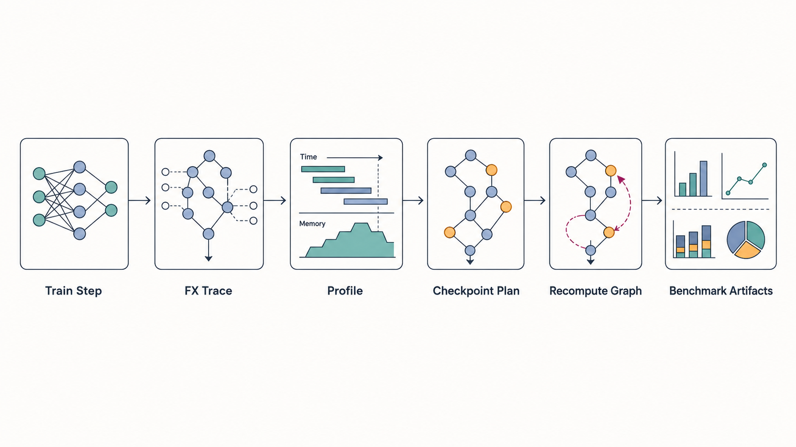

# Profiler-Guided Activation Checkpointing with PyTorch FX



This repository is a prototype for activation checkpointing with PyTorch FX. It is inspired by ideas from the MLSys 2023 paper [mu-TWO: 3x Faster Multi-Model Training with Orchestration and Memory Optimization](https://proceedings.mlsys.org/paper_files/paper/2023/file/a72071d84c001596e97a2c7e1e880559-Paper-mlsys2023.pdf).

The project traces a full PyTorch training step into an FX graph, profiles activation lifetimes and memory pressure, chooses recomputation candidates, rewrites the graph, and compares baseline versus activation-checkpointed execution on ResNet-152 and BERT.

This is a research/education prototype, not a drop-in replacement for PyTorch's production activation checkpointing APIs.

## What This Project Does

The workflow is:

```text
training step -> FX trace -> graph profile -> checkpoint plan -> rewritten graph -> benchmark artifacts
```

The main components are:

- [graph_tracer.py](graph_tracer.py): captures one training iteration, including forward, backward, and optimizer work.
- [graph_prof.py](graph_prof.py): profiles the traced graph and estimates activation lifetimes, recompute costs, and peak-memory breakdowns.
- [activation_checkpoint.py](activation_checkpoint.py): builds a recomputation plan and rewrites the FX graph.
- [benchmarks.py](benchmarks.py): runs baseline and activation-checkpointed experiments for `ResNet-152` and `BERT`.
- [docs/experimental_analysis.md](docs/experimental_analysis.md): summarizes the saved experiment results.

## Paper Context

The implementation borrows the high-level motivation from mu-TWO: memory pressure can be reduced by choosing which activations to retain, recompute, or otherwise manage.

This implementation focuses on the recomputation part only:

- It does not implement mu-TWO's full multi-model scheduler.
- It does not implement activation swapping/offloading.
- It uses a simplified profiler-guided heuristic rather than the full system from the paper.
- It rewrites selected FX graph values instead of applying module-level checkpoint wrappers.

## Key Ideas

### FX Graph Capture

The tracer wraps a normal training function and records a full training step as an FX `GraphModule`. Parameters, buffers, optimizer state, and runtime inputs are lifted into explicit graph inputs so the profiler and rewriter can reason about them.

The traced step includes:

- model forward pass
- loss computation
- backward pass
- optimizer update

### Graph Profiling

The profiler runs the FX graph through an `fx.Interpreter` and records:

- forward, backward, and optimizer phase boundaries
- per-node runtime samples
- tensor output sizes
- activation creation and first backward use
- parameter, gradient, optimizer-state, and activation memory categories
- modeled peak-memory timeline

### Checkpoint Planning

The checkpoint planner ranks activation candidates by estimated memory savings relative to recompute cost. The benchmark CLI default policy is:

```text
memory_budget_mb = None
min_savings_mb = 0.25
max_recompute_ratio = 1.0
min_recompute_budget_ms = 1.0
max_candidates = 8
prefer_peak_overlap = True
exclude_view_like_ops = True
```

The saved final sweeps use different candidate limits:

- ResNet-152 uses `--max-candidates 16` for a clearer checkpointing effect.
- BERT uses the default `8` candidates because `16` candidates caused OOM at larger batch sizes during the custom FX rewrite/profiling path.

### Graph Rewrite

For each selected activation, the rewriter:

- extracts the producer subgraph needed to recompute the activation
- clones that subgraph into the backward region
- inserts the recomputation before the first backward-time use
- rewires later uses to consume the recomputed value
- preserves forward-region uses of the original activation

## Environment Setup

The full benchmark workflow assumes a CUDA-capable PyTorch installation. CPU execution is useful for basic checks, but memory measurements are not representative.

```powershell
conda create -n fx-checkpointing python=3.12
conda activate fx-checkpointing
pip install -r requirements.txt
```

The requirements file installs the CUDA 12.4 PyTorch wheels used for the saved experiments. If your machine needs a different PyTorch build, install the matching `torch` and `torchvision` wheels from the [PyTorch installation selector](https://pytorch.org/get-started/locally/) and then install the remaining packages from `requirements.txt`.

## Quick Start

Run the small starter example:

```powershell
conda activate fx-checkpointing
python starter_code.py
```

Run the same starter flow with activation checkpointing enabled:

```powershell
python starter_code.py --use-ac --output-dir outputs/starter_ac
```

Run validation tests:

```powershell
python -m unittest tests.test_graph_profiler tests.test_activation_checkpoint tests.test_graph_tracer
```

## Reproducing The Saved Experiments

The current final artifacts under `outputs/final_runs_multi` were generated with:

```powershell
python benchmarks.py --model ResNet-152 --batch-sizes 1 2 4 6 8 --image-size 320 --max-candidates 16 --output-dir outputs/final_runs_multi
python benchmarks.py --model BERT --batch-sizes 1 2 4 6 8 --seq-len 512 --vocab-size 4096 --output-dir outputs/final_runs_multi
```

For a faster BERT dry run, use the reduced debug configuration:

```powershell
python benchmarks.py --model BERT --batch-sizes 1 2 --seq-len 128 --debug-bert
```

Checkpoint policy knobs can be adjusted from the CLI:

```powershell
python benchmarks.py --model ResNet-152 --batch-sizes 1 2 4 --memory-budget-mb 6000 --min-savings-mb 0.25 --max-candidates 16 --max-recompute-ratio 1.0
```

For the current GPU setup, keep BERT at `--max-candidates 8` for the full `1 2 4 6 8` sweep. Higher candidate counts can be useful for small-batch probes, but can OOM at larger BERT batch sizes.

## Outputs

Benchmark artifacts are saved under [outputs](outputs).

Typical generated files include:

- `profiler_summary.json`
- `rewritten_profiler_summary.json`
- `checkpoint_plan.json`
- `sweep_results.csv`
- `peak_memory_vs_batch_size.png`
- `latency_vs_batch_size.png`
- `peak_memory_breakdown_stacked.png`
- `manifest.json`

The current experiment interpretation is in [docs/experimental_analysis.md](docs/experimental_analysis.md).

## Assumptions And Limitations

- The BERT benchmark uses a randomly initialized BERT-style masked language model from configuration, not a downloaded pretrained checkpoint.
- The implementation checkpoints individual FX graph values, not whole ResNet blocks or BERT transformer layers.
- The checkpoint policy is heuristic and profiler-driven rather than an exact implementation of mu-TWO.
- Activation checkpointing reduces activation memory only. It does not reduce parameter, gradient, or Adam optimizer-state memory.
- The profiler's memory model is static and lifetime-based; actual CUDA peak memory also depends on allocator behavior, kernel workspaces, and temporary recomputation tensors.
- Latency measurements use a small number of timed iterations, so they should be interpreted as coarse experimental signals.

## Repository Guide

- [graph_tracer.py](graph_tracer.py): FX capture of one training iteration.
- [graph_prof.py](graph_prof.py): graph profiling, activation lifetime analysis, and summary export.
- [activation_checkpoint.py](activation_checkpoint.py): checkpoint selection and graph rewrite.
- [benchmarks.py](benchmarks.py): benchmark runner and plot generation.
- [starter_code.py](starter_code.py): lightweight starter example.
- [docs](docs): supporting project documents, including the experimental analysis and course/paper references.
- [tests](tests): validation tests for profiler and rewrite correctness.

## References

- [Harvard CS265: Big Data Systems](http://daslab.seas.harvard.edu/classes/cs265/)
- [mu-TWO: 3x Faster Multi-Model Training with Orchestration and Memory Optimization](https://proceedings.mlsys.org/paper_files/paper/2023/file/a72071d84c001596e97a2c7e1e880559-Paper-mlsys2023.pdf), MLSys 2023
- [Harvard John A.Paulson School of Engineering and Applied Sciences](https://seas.harvard.edu/)
- [Data & AI Systems Labotoray at Harvard School of Engineering and Applied Science](http://daslab.seas.harvard.edu/)
