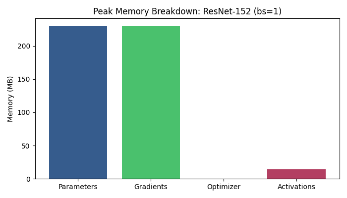
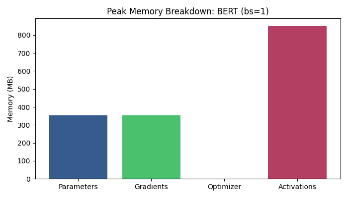
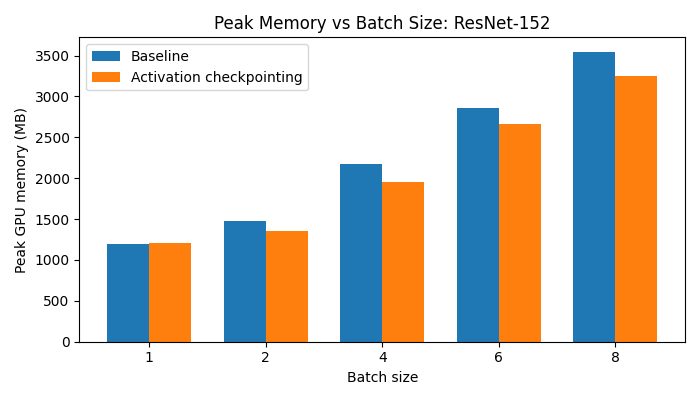
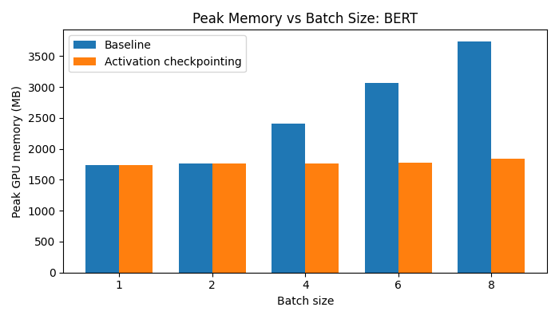
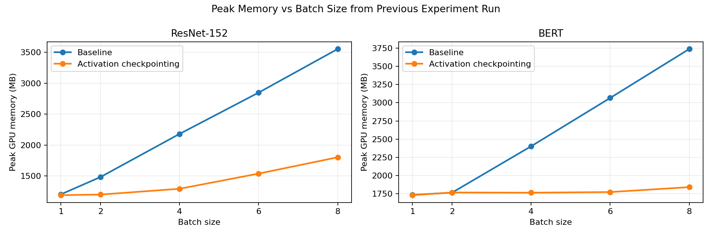
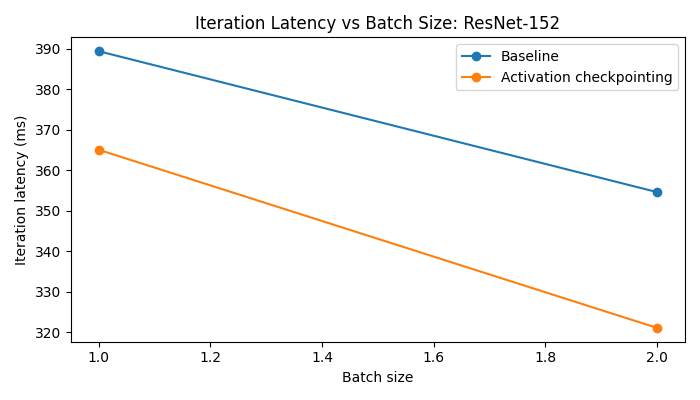
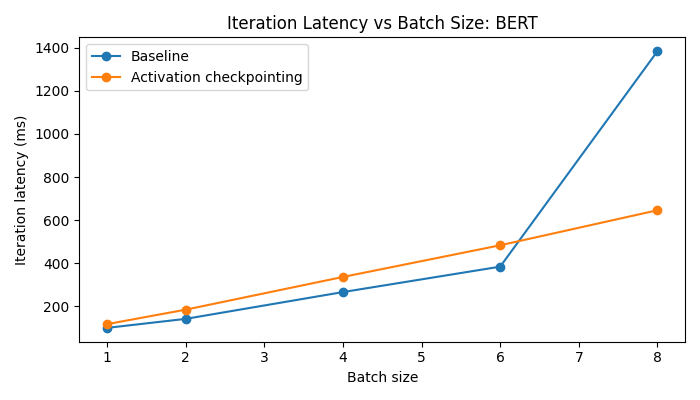

# Experimental Analysis

This document summarizes the current experimental artifacts saved under [outputs/final_runs_multi](/C:/Users/inorz/OneDrive/Documents/Harvard/mutwo-activation-checkpointing/outputs/final_runs_multi).

The final saved sweeps use mini-batch sizes `1`, `2`, `4`, `6`, and `8` for both model families:

- `ResNet-152`, input image size `320 x 320`
- `BERT`, sequence length `512`, vocabulary size `4096`, full non-debug BERT configuration

The plots, CSV files, profiler summaries, checkpoint plans, and rewritten-profiler summaries have been regenerated for these settings.

## Design Choices

The project still keeps the PyTorch FX workflow for graph capture, static activation-lifetime analysis, checkpoint-plan export, and graph-rewrite validation. However, allocator-level memory measurements are now taken from eager training with runtime activation checkpointing enabled. This distinction matters because the original FX-interpreter measurement path demonstrated graph rewriting, but it did not reliably model PyTorch autograd's normal retained-activation memory behavior.

The final implementation uses:

- FX profiling and checkpoint planning for inspection artifacts.
- Runtime checkpointing for measured GPU peak memory.
- `torch.utils.checkpoint.checkpoint` on ResNet residual blocks.
- Hugging Face `gradient_checkpointing_enable` for BERT.
- `preserve_rng_state=False` for checkpointed runtime paths to reduce checkpoint bookkeeping overhead.
- CUDA cache/peak-stat cleanup before measurement.
- A profiler cleanup fix so `GraphProfiler` does not retain runtime tensors after profiling.

The custom checkpoint planner now uses a simplified, recompute-only version of the Mutwo policy from the MLSys 2023 paper. The full Mutwo system combines multi-model scheduling, activation swapping, and activation recomputation. This project only rewrites recomputation candidates, so the implemented subset does the following:

- Builds recomputation candidates from profiled activation size, lifetime, and estimated recompute cost.
- Models the inactive interval between an activation's last forward use and its first backward use.
- Scores recomputation candidates by memory saved per recompute cost, with inactive time and size as tie breakers.
- Prioritizes activations that overlap the modeled peak live set.
- Iteratively simulates total peak memory after each recompute decision and stops when the configured memory budget, candidate limit, or recompute-cost limit is reached.

This replaces the earlier simple heuristic that sorted individual activations by peak overlap and size-per-cost without validating each choice against a simulated memory timeline. The planner also avoids spending checkpoint slots on view-like or alias-like candidates such as `t`, `view`, `transpose`, `expand`, and `getitem`. Those tensors can appear large from shape alone, but often do not own new CUDA storage, so recomputing them rarely reduces allocator peak memory.

For BERT, the benchmark uses `vocab_size=4096` instead of the default `30522`. The original default vocabulary made the language-modeling head dominate memory, masking the effect of checkpointing transformer-layer activations. The reduced vocabulary keeps the BERT-style workflow intact, while `seq_len=512` makes transformer activations large enough for checkpointing to produce a clear memory reduction at larger batch sizes.

## A. Computation And Memory Profiling Statistics And Static Analysis

### ResNet-152

Runtime summary at batch size `1`:

| Mode | Avg latency (ms) | Peak GPU memory (MB) | Correctness check |
| --- | ---: | ---: | --- |
| Baseline | 123.19 | 1205.14 | N/A |
| With AC | 169.10 | 1191.45 | Passed |

Static memory breakdown from the batch-size-1 baseline profiler summary:

| Component | Peak memory (MB) |
| --- | ---: |
| Parameters | 229.62 |
| Gradients | 229.62 |
| Optimizer state | 0.00 |
| Activations | 352.54 |
| Total traced peak | 811.78 |

Static-analysis summary:

- Activation candidates identified: `778`
- The largest apparent candidate was `t` with shape `[2048, 1000]` and size `7.81 MB`
- The largest materialized feature-map candidates include tensors with shape `[1, 256, 80, 80]` and size `6.25 MB`
- The simplified Mutwo recompute policy selected `4` activations for recomputation in the batch-size-1 saved plan:
  - `convolution_10`
  - `convolution_7`
  - `convolution_3`
  - `relu_`
- Estimated saved activation bytes from the batch-size-1 plan: approximately `25.00 MB`
- Estimated static traced peak after the recompute plan: approximately `786.78 MB`

Largest baseline activation candidates:

| Activation | Shape | Size (MB) | First backward user |
| --- | --- | ---: | --- |
| `t` | `[2048, 1000]` | 7.81 | `t_1` |
| `relu__9` | `[1, 256, 80, 80]` | 6.25 | `convolution_backward_140` |
| `convolution_3` | `[1, 256, 80, 80]` | 6.25 | `cudnn_batch_norm_backward_151` |
| `convolution_7` | `[1, 256, 80, 80]` | 6.25 | `cudnn_batch_norm_backward_147` |
| `convolution_4` | `[1, 256, 80, 80]` | 6.25 | `cudnn_batch_norm_backward_150` |

Peak-memory breakdown plot:



### BERT

Runtime summary at batch size `1`:

| Mode | Avg latency (ms) | Peak GPU memory (MB) | Correctness check |
| --- | ---: | ---: | --- |
| Baseline | 93.00 | 1735.04 | N/A |
| With AC | 117.25 | 1730.79 | Passed |

Static memory breakdown from the batch-size-1 baseline profiler summary:

| Component | Peak memory (MB) |
| --- | ---: |
| Parameters | 352.26 |
| Gradients | 352.26 |
| Optimizer state | 0.00 |
| Activations | 849.52 |
| Total traced peak | 1554.04 |

Static-analysis summary:

- Activation candidates identified: `366`
- The largest apparent candidates are expanded attention masks with shape `[1, 12, 512, 512]` and size `12.00 MB`
- Several projection matrices with shapes `[768, 4096]`, `[768, 3072]`, and `[3072, 768]` also appear as large recomputable candidates
- The batch-size-1 plan selected `gelu_12`, `_log_softmax`, `add_1`, and `add_14` for recomputation
- Estimated saved activation bytes from the batch-size-1 plan: approximately `12.50 MB`
- Estimated static traced peak after the recompute plan: approximately `1549.54 MB`

Largest baseline activation candidates:

| Activation | Shape | Size (MB) | First backward user |
| --- | --- | ---: | --- |
| `expand_9` | `[1, 12, 512, 512]` | 12.00 | `_scaled_dot_product_efficient_attention_backward_5` |
| `expand_12` | `[1, 12, 512, 512]` | 12.00 | `_scaled_dot_product_efficient_attention_backward_2` |
| `expand_11` | `[1, 12, 512, 512]` | 12.00 | `_scaled_dot_product_efficient_attention_backward_3` |
| `expand_5` | `[1, 12, 512, 512]` | 12.00 | `_scaled_dot_product_efficient_attention_backward_9` |
| `expand_3` | `[1, 12, 512, 512]` | 12.00 | `_scaled_dot_product_efficient_attention_backward_11` |

Peak-memory breakdown plot:



### Interpretation

- The FX profiler continues to separate forward, backward, and optimizer regions and produce activation-lifetime data for checkpoint planning.
- The runtime measurements now use real eager activation checkpointing, which better reflects allocator-level memory behavior.
- ResNet shows clear peak-memory reduction as activation memory grows with image and batch size.
- BERT shows small reductions at batch sizes `1` and `2`, then large reductions once sequence-length and batch-size make attention activations dominate the peak.
- Correctness checks passed for all AC-enabled saved runs.

## B. Peak Memory Consumption Vs Mini-Batch Size Bar Graph

ResNet-152 sweep bar graph:



BERT sweep bar graph:



The peak-memory plots were also regenerated directly from the latest saved CSV files:



Observed values from the current saved multi-batch runs:

| Model | Batch size | Baseline peak memory (MB) | AC peak memory (MB) | Reduction |
| --- | ---: | ---: | ---: | ---: |
| ResNet-152 | 1 | 1205.14 | 1191.45 | 1.14% |
| ResNet-152 | 2 | 1484.28 | 1201.39 | 19.06% |
| ResNet-152 | 4 | 2181.79 | 1294.54 | 40.67% |
| ResNet-152 | 6 | 2849.09 | 1540.16 | 45.94% |
| ResNet-152 | 8 | 3554.15 | 1803.87 | 49.25% |
| BERT | 1 | 1735.04 | 1730.79 | 0.24% |
| BERT | 2 | 1765.32 | 1767.69 | -0.13% |
| BERT | 4 | 2401.97 | 1764.74 | 26.53% |
| BERT | 6 | 3065.78 | 1773.41 | 42.15% |
| BERT | 8 | 3738.09 | 1840.96 | 50.75% |

Interpretation:

- ResNet shows the expected checkpointing curve: savings grow with batch size because activation memory grows while model state remains mostly fixed.
- BERT at `seq_len=512` now shows the same effect at larger batch sizes. Batch sizes `1` and `2` remain close to flat because fixed model memory still dominates.
- The batch-size-2 BERT AC run is slightly above baseline by `2.38 MB`, which is within fixed-overhead/noise for this setup; batch sizes `4`, `6`, and `8` show the intended memory-saving regime clearly.

## C. Iteration Latency Vs Mini-Batch Size

ResNet-152 latency plot:



BERT latency plot:



Observed values from the current saved multi-batch runs:

| Model | Batch size | Baseline latency (ms) | AC latency (ms) |
| --- | ---: | ---: | ---: |
| ResNet-152 | 1 | 123.19 | 169.10 |
| ResNet-152 | 2 | 128.12 | 134.69 |
| ResNet-152 | 4 | 180.03 | 182.38 |
| ResNet-152 | 6 | 215.85 | 252.19 |
| ResNet-152 | 8 | 927.33 | 312.69 |
| BERT | 1 | 93.00 | 117.25 |
| BERT | 2 | 149.69 | 188.86 |
| BERT | 4 | 265.95 | 334.21 |
| BERT | 6 | 381.91 | 482.70 |
| BERT | 8 | 628.60 | 633.96 |

Interpretation:

- Activation checkpointing trades compute for memory by recomputing selected activations during backward.
- ResNet generally pays a visible latency cost from recomputation, though the latest batch-size-8 AC run is faster than the corresponding baseline measurement. That point should be treated as noisy because the baseline latency is much larger than the surrounding trend.
- BERT pays recomputation overhead at every measured batch size in the latest run, with the batch-size-8 AC latency nearly matching baseline while cutting peak memory by about half.
- Longer runs with more iterations would give smoother latency estimates, but the current plots are sufficient to show the memory-performance tradeoff.

## Reproduction

The current plots and summaries were generated from:

```powershell
conda run -n cs265 python benchmarks.py --model "ResNet-152" --batch-sizes 1 2 4 6 8 --image-size 320 --output-dir outputs/final_runs_multi
conda run -n cs265 python benchmarks.py --model "BERT" --batch-sizes 1 2 4 6 8 --seq-len 512 --vocab-size 4096 --output-dir outputs/final_runs_multi
conda run -n cs265 python plot_previous_peak_memory.py
```

The validation tests were run with:

```powershell
conda run -n cs265 python -m unittest tests.test_graph_profiler tests.test_activation_checkpoint
```
