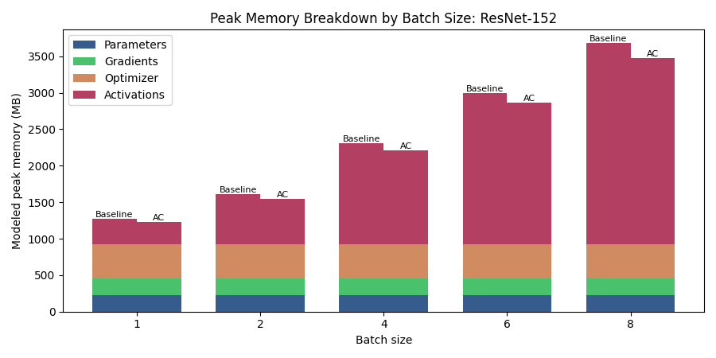
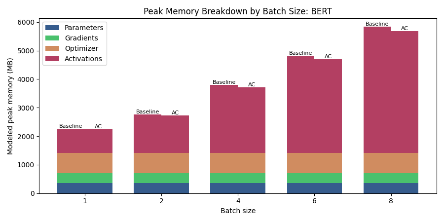

# Experimental Analysis

This document summarizes the current experimental artifacts saved under [outputs/final_runs_multi](../outputs/final_runs_multi).

The saved sweeps use:

- `ResNet-152`, mini-batch sizes `1`, `2`, `4`, `6`, and `8`, input image size `320 x 320`
- `BERT`, mini-batch sizes `1`, `2`, `4`, `6`, and `8`, sequence length `512`, vocabulary size `4096`, full non-debug BERT configuration

Each batch size has a baseline run and an activation-checkpointed run. The activation-checkpointed runs execute the custom FX graph rewrite path, not PyTorch's built-in module-level checkpoint wrapper.

## Design Choices

The project uses PyTorch FX to capture a full training step, profile the graph, estimate activation lifetimes, choose recomputation candidates, and rewrite the graph. The same compiled measurement path is used for baseline and activation-checkpointed runs.

The final implementation uses:

- FX tracing of the full training step, including forward, backward, and optimizer update.
- `GraphProfiler` for node-level timing, activation-lifetime analysis, and memory-breakdown artifacts.
- A recompute-only checkpoint planner inspired by the Mutwo policy.
- Custom FX subgraph extraction and graph rewriting for selected activation recomputation.
- Correct optimizer-state accounting in the memory breakdown, including Adam state tensors such as `exp_avg` and `exp_avg_sq`.
- A sweep-level stacked memory-breakdown plot instead of per-run breakdown plots.

The benchmark CLI default checkpoint policy is:

```text
memory_budget_mb = None
min_savings_mb = 0.25
max_recompute_ratio = 1.0
min_recompute_budget_ms = 1.0
max_candidates = 8
prefer_peak_overlap = True
exclude_view_like_ops = True
```

The saved final sweeps use different candidate limits by model:

- ResNet-152 uses `--max-candidates 16` to show a clearer checkpointing effect across the image batch-size sweep.
- BERT uses the CLI default `--max-candidates 8` because `16` candidates caused OOM at larger batch sizes such as `6` and `8` during the custom FX rewrite/profiling path.

The planner:

- Builds candidates from profiled activation size, lifetime, and recompute cost.
- Prioritizes activations that overlap the modeled peak live set.
- Scores candidates by memory saved per recompute cost, with inactive time and tensor size as tie breakers.
- Skips view-like or alias-like candidates such as `view`, `transpose`, `expand`, and `getitem`.
- Greedily selects up to the configured candidate limit while respecting the recompute budget.

## Implementation Limitations

The implementation checkpoints selected FX activation values rather than whole ResNet blocks or BERT transformer layers. That design is useful for demonstrating graph-level profiling and rewriting, but it is less aggressive than production activation checkpointing, which often wraps entire modules.

The main limitations are:

- The peak-memory model is static and tensor-lifetime based. CUDA peak memory also depends on temporary kernel workspaces, allocator caching, fragmentation, and cloned recomputation outputs.
- The implementation is recompute-only. It does not implement Mutwo's activation swapping/offloading or multi-job scheduling.
- The planner has a conservative candidate cap of `8` in the benchmark CLI. Increasing this can improve savings but may also increase recomputation overhead or cause OOM at larger BERT batch sizes.
- BERT memory is spread across many transformer operations. Individual-node recomputation reduces some activation lifetimes, but it does not drop a whole transformer's intermediate footprint the way block-level checkpointing would.
- Only three measured iterations are used per run, so latency should be interpreted as a coarse signal rather than a stable microbenchmark.

## A. Static Profiling And Memory Breakdown

The stacked plots below compare modeled peak memory composition for baseline and activation-checkpointed runs. The AC bars use each run's rewritten-profiler summary, so the activation slice reflects the graph after recomputation nodes were inserted.

ResNet-152 stacked memory breakdown:



BERT stacked memory breakdown:



### ResNet-152 Static Breakdown

At batch size `1`, the baseline profiler reports:

| Component | Baseline MB | AC rewritten MB |
| --- | ---: | ---: |
| Parameters | 229.62 | 229.62 |
| Gradients | 229.62 | 229.62 |
| Optimizer state | 459.24 | 459.24 |
| Activations | 352.54 | 305.67 |

At batch size `8`, the profiler reports:

| Component | Baseline MB | AC rewritten MB |
| --- | ---: | ---: |
| Parameters | 229.62 | 229.62 |
| Gradients | 229.62 | 229.62 |
| Optimizer state | 459.24 | 459.24 |
| Activations | 2761.61 | 2561.61 |

ResNet plan summary:

| Batch size | Recomputed activations | Estimated saved activation MB | Estimated planned peak MB |
| ---: | ---: | ---: | ---: |
| 1 | 8 | 46.88 | 1224.14 |
| 2 | 8 | 65.63 | 1549.54 |
| 4 | 8 | 93.75 | 2209.72 |
| 6 | 8 | 121.88 | 2869.90 |
| 8 | 8 | 200.00 | 3480.08 |

Interpretation:

- ResNet activation memory grows strongly with batch size because feature-map tensors scale with the image batch.
- The AC rewritten summaries show lower activation memory at every batch size.
- Fixed memory from parameters, gradients, and Adam optimizer state remains unchanged, so total memory falls less than activation memory alone.

### BERT Static Breakdown

At batch size `1`, the baseline profiler reports:

| Component | Baseline MB | AC rewritten MB |
| --- | ---: | ---: |
| Parameters | 352.26 | 352.26 |
| Gradients | 352.26 | 352.26 |
| Optimizer state | 704.52 | 704.52 |
| Activations | 849.52 | 831.02 |

At batch size `8`, the profiler reports:

| Component | Baseline MB | AC rewritten MB |
| --- | ---: | ---: |
| Parameters | 352.26 | 352.26 |
| Gradients | 352.26 | 352.26 |
| Optimizer state | 704.52 | 704.52 |
| Activations | 4428.38 | 4280.38 |

BERT plan summary:

| Batch size | Recomputed activations | Estimated saved activation MB | Estimated planned peak MB |
| ---: | ---: | ---: | ---: |
| 1 | 8 | 18.50 | 2248.06 |
| 2 | 8 | 37.00 | 2748.82 |
| 4 | 8 | 74.00 | 3750.35 |
| 6 | 8 | 111.00 | 4751.88 |
| 8 | 8 | 148.00 | 5753.42 |

Interpretation:

- BERT activation memory is reduced, but the reduction is modest because only eight individual FX activation values are checkpointed.
- The planner intentionally skips many view-like attention tensors, which can be large by shape but may not own meaningful allocator storage.
- A block-level transformer checkpointing strategy would likely show a larger activation-memory drop, but that is outside this project's current fine-grained FX rewrite design.

## B. Peak Memory Consumption Vs Mini-Batch Size

ResNet-152 peak memory plot:


BERT peak memory plot:


Observed peak GPU memory:

| Model | Batch size | Baseline MB | AC MB | Reduction |
| --- | ---: | ---: | ---: | ---: |
| ResNet-152 | 1 | 1196.37 | 1212.18 | -1.32% |
| ResNet-152 | 2 | 1470.85 | 1410.79 | 4.08% |
| ResNet-152 | 4 | 2173.71 | 2076.08 | 4.49% |
| ResNet-152 | 6 | 2852.44 | 2738.07 | 4.01% |
| ResNet-152 | 8 | 3549.62 | 3350.90 | 5.60% |
| BERT | 1 | 1718.10 | 1715.35 | 0.16% |
| BERT | 2 | 1733.62 | 1744.87 | -0.65% |
| BERT | 4 | 2417.96 | 2360.21 | 2.39% |
| BERT | 6 | 3081.90 | 3022.53 | 1.93% |
| BERT | 8 | 3766.46 | 3728.09 | 1.02% |

Interpretation:

- ResNet shows consistent memory reduction once batch size is at least `2`. Batch size `1` is slightly worse because the saved activation memory is small compared with rewrite and allocator effects.
- BERT reductions are smaller. The current planner shortens the lifetime of selected activations, but it does not remove enough of the transformer's peak live activation set to create a large total-memory drop.
- Optimizer memory is now correctly counted. Since Adam state is fixed with respect to batch size, it makes the total-memory reduction percentage look smaller than activation-only savings.

## C. Iteration Latency Vs Mini-Batch Size

ResNet-152 latency plot:


BERT latency plot:


Observed latency:

| Model | Batch size | Baseline ms | AC ms |
| --- | ---: | ---: | ---: |
| ResNet-152 | 1 | 355.31 | 325.90 |
| ResNet-152 | 2 | 309.75 | 292.70 |
| ResNet-152 | 4 | 343.90 | 314.19 |
| ResNet-152 | 6 | 437.84 | 412.92 |
| ResNet-152 | 8 | 471.02 | 505.32 |
| BERT | 1 | 174.94 | 176.65 |
| BERT | 2 | 239.03 | 271.39 |
| BERT | 4 | 356.38 | 398.11 |
| BERT | 6 | 511.98 | 1162.69 |
| BERT | 8 | 1380.26 | 684.32 |

Interpretation:

- Activation checkpointing normally trades compute for memory because discarded activations are recomputed during backward.
- The measured latency is noisy because each point uses only a few timed iterations and the custom FX interpreter/rewrite path can interact with CUDA allocation, kernel warmup, and cache state.
- The BERT batch-size-6 and batch-size-8 latency points have high variance and should not be overinterpreted as stable speedups or slowdowns.
- The key result is that correctness checks passed for all AC runs and memory is reduced in most measured settings, while latency remains in the same broad regime except for noisy larger-BERT points.

## Reproduction

The current final artifacts were generated with:

```powershell
conda run -n cs265 python benchmarks.py --model ResNet-152 --batch-sizes 1 2 4 6 8 --image-size 320 --max-candidates 16 --output-dir outputs/final_runs_multi
conda run -n cs265 python benchmarks.py --model BERT --batch-sizes 1 2 4 6 8 --seq-len 512 --vocab-size 4096 --output-dir outputs/final_runs_multi
```

The validation tests were run with:

```powershell
conda run -n cs265 python -m unittest tests.test_graph_profiler tests.test_activation_checkpoint tests.test_graph_tracer
```
